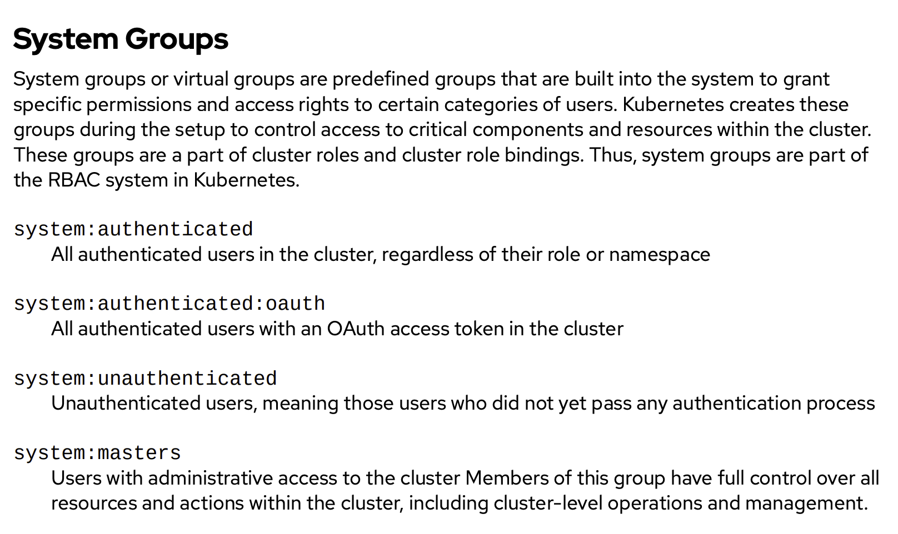
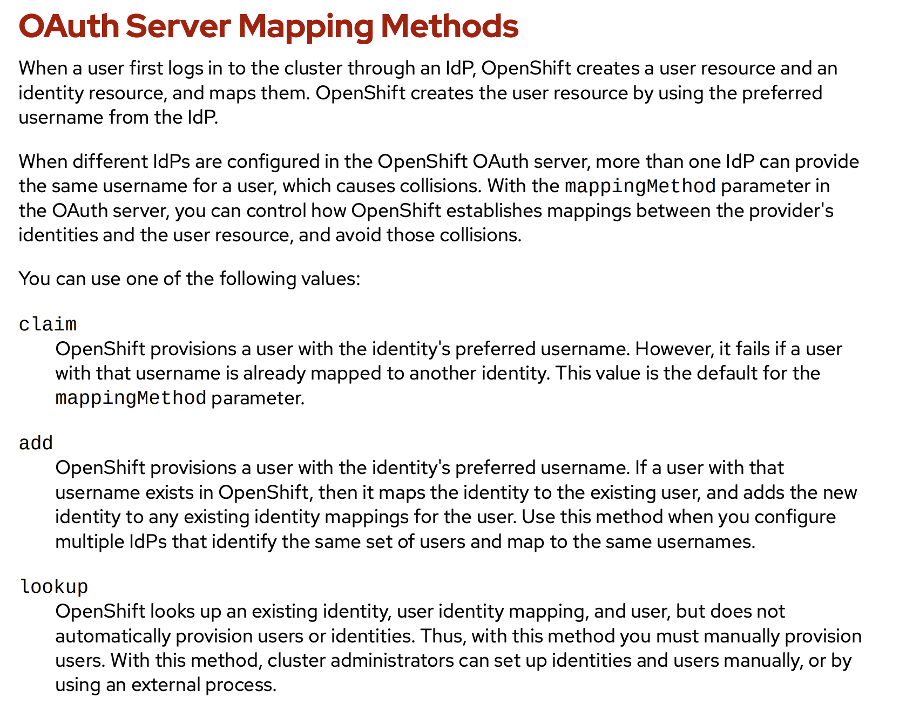
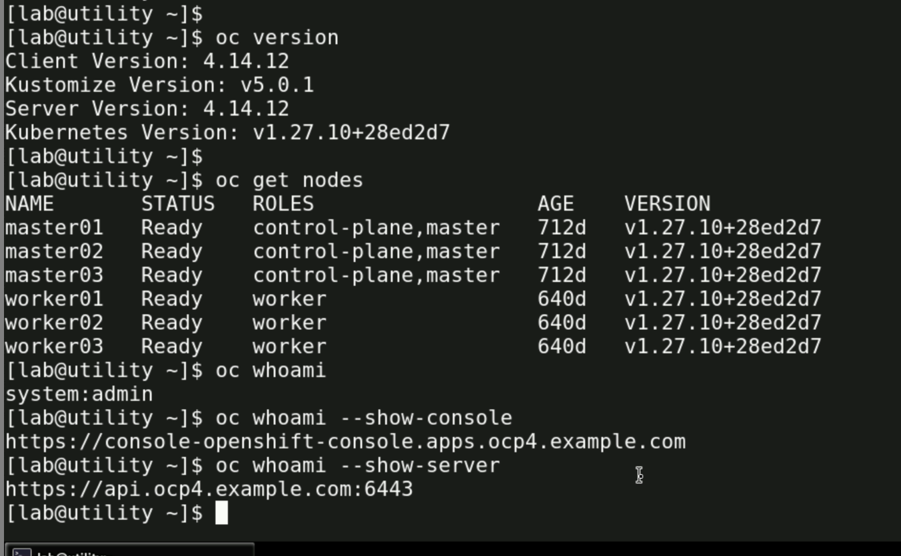
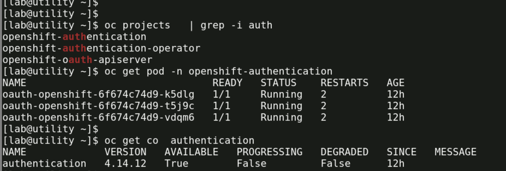
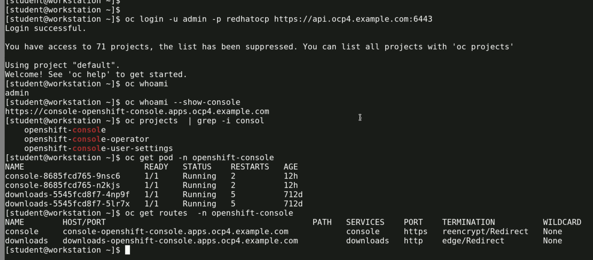

# vodafone-do380-16thfeb2026

## 1. Big Picture Architecture

In OpenShift 4.x, authentication is handled by:

- Kubernetes API Server
- OpenShift OAuth Server
- Identity Providers (IdPs)
- RBAC Engine

Think of it in 4 layers:

```
User → Identity Provider → OpenShift OAuth → RBAC → Resource Access
```


## Authentication Flow Diagram

```
                    ┌─────────────────────────────┐
                    │            USER             │
                    │  (oc login / Web Console)   │
                    └──────────────┬──────────────┘
                                   │
                                   ▼
                ┌──────────────────────────────────┐
                │       Identity Provider (IdP)    │
                │                                  │
                │  - LDAP / AD                     │
                │  - OIDC (Keycloak, Azure AD)     │
                │  - HTPasswd                      │
                └──────────────┬───────────────────┘
                               │
                               ▼
               ┌────────────────────────────────────┐
               │      OpenShift OAuth Server        │
               │                                    │
               │  - Validates IdP response          │
               │  - Creates User & Identity objects │
               │  - Issues OAuth Access Token       │
               └──────────────┬─────────────────────┘
                              │
                              ▼
            ┌────────────────────────────────────────┐
            │        Kubernetes API Server           │
            │                                        │
            │  - Validates Bearer Token              │
            │  - Authenticates user context          │
            └──────────────┬─────────────────────────┘
                           │
                           ▼
            ┌────────────────────────────────────────┐
            │              RBAC Engine               │
            │                                        │
            │  - Evaluates Role/ClusterRole          │
            │  - Checks RoleBinding/CRB              │
            │  - Matches User/Group permissions      │
            └──────────────┬─────────────────────────┘
                           │
                           ▼
            ┌────────────────────────────────────────┐
            │          Resource Access               │
            │                                        │
            │  Pods | Deployments | Projects | etc.  │
            └────────────────────────────────────────┘
```

### user auth with group understanding as per permission 



### mapping method 



### some basic command in ocp to check user login details 



### checking oauth health by checking pod / operator health



### login to OCP and checking console URL 

